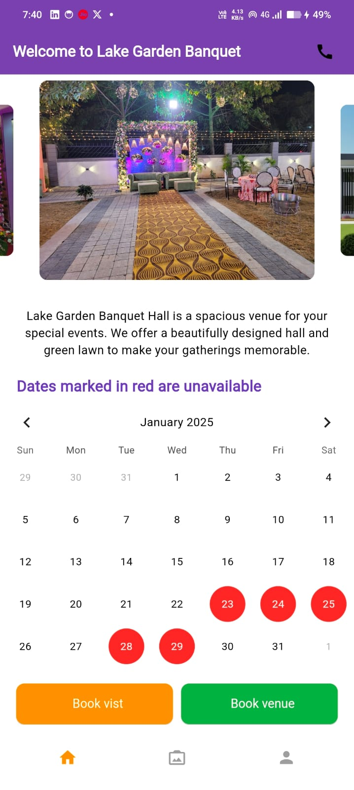

# Lake Garden Banquet Hall Booking App

Welcome to the **Lake Garden Banquet Hall Booking App**! This app is designed to help you easily book and manage your events at the Lake Garden Banquet Hall. Whether you're planning a wedding, corporate event, or any other special occasion, our app provides a seamless booking experience.

## Features

- **Event Booking**: Easily book your event by selecting the date, event type, and services you need.
- **Availability Calendar**: View available dates marked clearly on the calendar.
- **Service Selection**: Choose from a variety of services including AC Rooms, Common Washrooms, Parking Space, Kitchen, Stage Setup, and Hall Furniture.
- **Billing Summary**: Get a detailed billing summary for your event with the total cost.
- **Appointment Booking**: Schedule appointments for consultations or site visits.

## Screenshots
### Welcome Screen

### Home Screen

### Book Appointment

### Book Banquet

### Payment Screen

## How to Use

1. **Sign In**: Sign in with Google to start using the app.
2. **Select Event Type**: Choose the type of event you want to book (e.g., Wedding, Birthday, Corporate).
3. **Choose Dates**: Select the dates for your event from the availability calendar.
4. **Select Services**: Pick the services you need for your event.
5. **Review Billing**: Check the billing summary for your selected services and dates.
6. **Book Appointment**: Schedule an appointment for further discussions or site visits.

